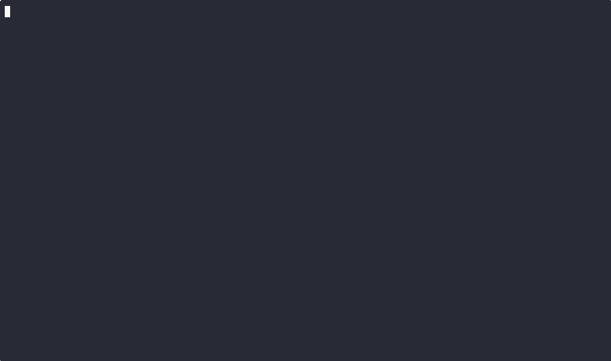

gdbsos — GDB SOS plugin to make gdb doing .net debugging

- src/gdbplugin/sos: Python plugin (GDB commands, services, ABI).
- src/gdbplugin/bridge: Native bridge (CMake + bridge.cpp).
- src/diagnostics: .NET diagnostics submodule.
- src/runtime: .NET runtime submodule

## How to use

- Extract the gdbsos tar to a folder you control (example: ~/gdbsos or any path you prefer).
	- If you also downloaded the symbols tar (…symbols.tar.gz), extract it into the same folder.
- In GDB, source the plugin and explore commands:
	- source /path/to/sos.py
	- sos help
	or
	- clrstack
- libsos.so discovery order at gdbsos:
	1) $SOS_ROOT/libsos.so
	2) ~/.dotnet/sos/libsos.so
	3) The directory containing sos.py
- Bridge co-location policy: regardless of where sos.py resides, when libsos.so is found in another directory we stage (copy if necessary) and always load libsosgdbbridge.so from the same directory as libsos.so. This is required for reliable managed hosting (prevents hosting delegate 0x80070002 failures). 

## How to build
Dev Container
- Reopen folder in container; submodules sync/init runs automatically.
- Manual build inside container:
	- ./build.sh -c Release

For troubleshooting and FAQs, see [FAQ / Troubleshooting](docs/faq.md).
